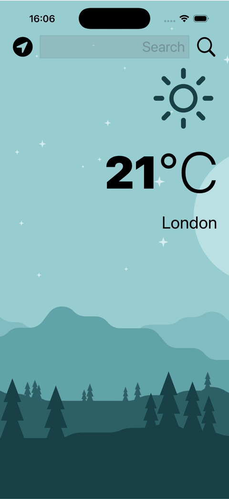
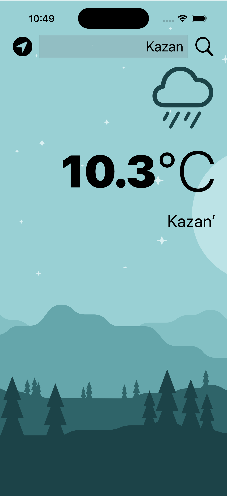
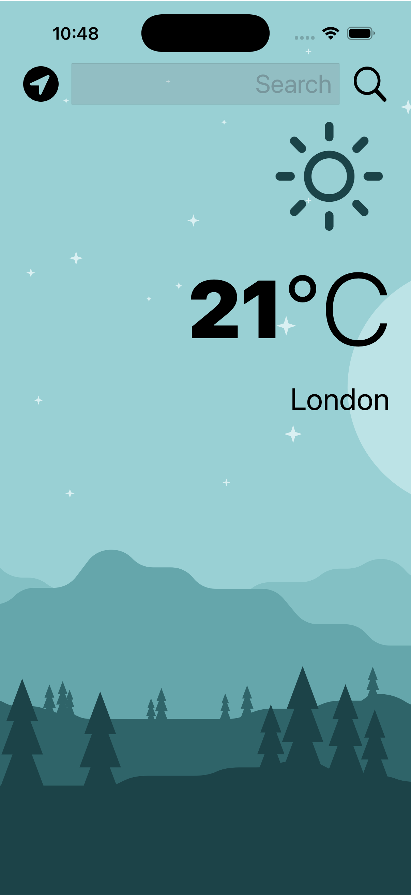
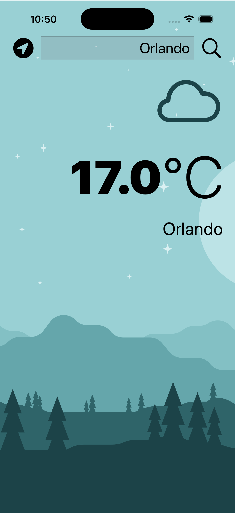
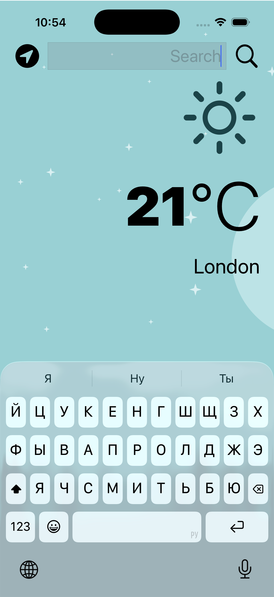

# 🌦 Clima iOS Weather App

A modern iOS weather application built with **Swift** using clean architecture and the **MVVM pattern**.  
The app provides real-time weather data with a clean UI and smooth user experience.

---

## 📱 Demo



---

## 🖼 Screenshots

### 🌍 Different Cities

| Kazan | London | Orlando |

|------|--------|--------|

|  |  |  |

---

### 📲 App Interface

| Main Screen |

|------------|

|  |

## 🚀 Features

- 🌍 Search weather by city name
- 📍 Get current location weather (CoreLocation)
- 🌡 Display temperature and weather conditions
- 🎨 Clean and minimal UI design
- ⚡ Fast and efficient API requests
- 🧠 Built using MVVM architecture

---

## 🛠 Tech Stack

- **Swift**
- **UIKit**
- **CoreLocation**
- **URLSession (REST API)**
- **MVVM Architecture**
- **Auto Layout**
- **Git & GitHub**

---

## 🧩 Architecture

The app follows the **MVVM (Model-View-ViewModel)** pattern:

- `ViewController`  
  Handles UI and user interactions  

- `ViewModel`  
  Contains business logic and data transformation  

- `Model`  
  Represents API data  

- `WeatherService`  
  Handles network requests  

---

## 🌐 API Integration

- Fetches real-time weather data from a public weather API  
- Uses **URLSession** and **Codable** for networking and parsing  

---

## 📂 Project Structure
Clima


```text

Clima

├── Controllers

├── ViewModels

├── Models

├── Services

├── Resources

└── screenshot

```

2. Run on simulator or real device

⸻

📚 What I Learned

* Implementing MVVM architecture in a real app
* Working with REST APIs using URLSession
* Parsing JSON using Codable
* Handling user location with CoreLocation
* Building responsive UI using Auto Layout
* Managing project structure and clean code practices

⸻

🎯 Why I Built This Project

I built this project to strengthen my iOS development skills and gain hands-on experience with:

* Real-world API integration
* Clean architecture (MVVM)
* UI/UX implementation
* Writing maintainable and scalable code

⸻

📌 Future Improvements

* 🔔 Push notifications for weather updates
* ⭐ Favorite cities feature
* 🌍 Multiple saved locations
* 📊 Detailed weather analytics
* ⚙️ Migration to SwiftUI

⸻

👨‍💻 Author

Aiaz

* GitHub: https://github.com/swiftio116
* LinkedIn: https://www.linkedin.com/in/aiaz-muzafarov-546a4a288

⸻

⭐️ Support

If you like this project, give it a ⭐️ on GitHub!
