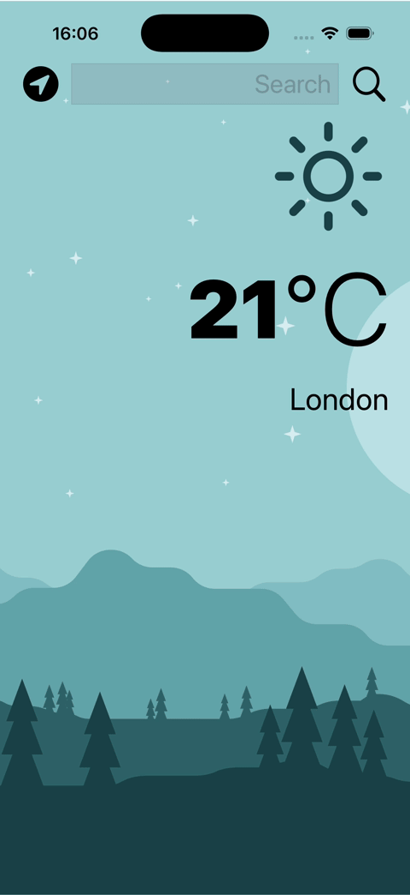
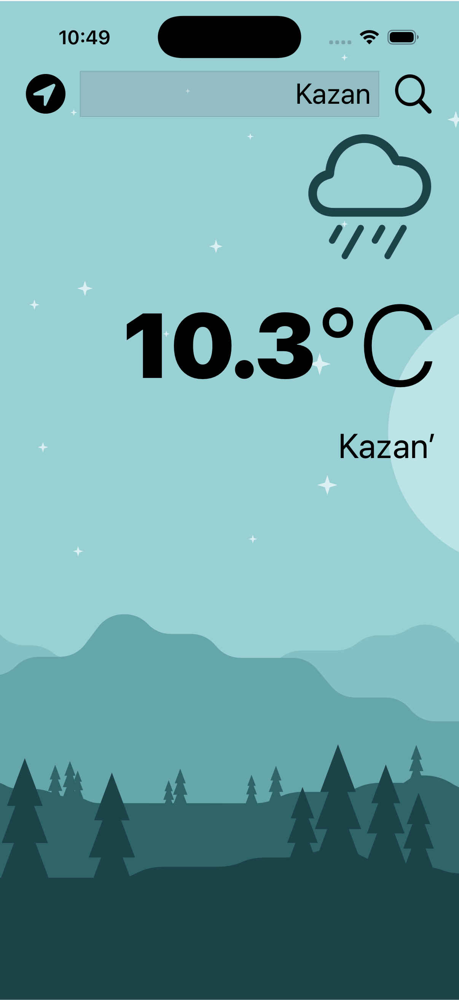
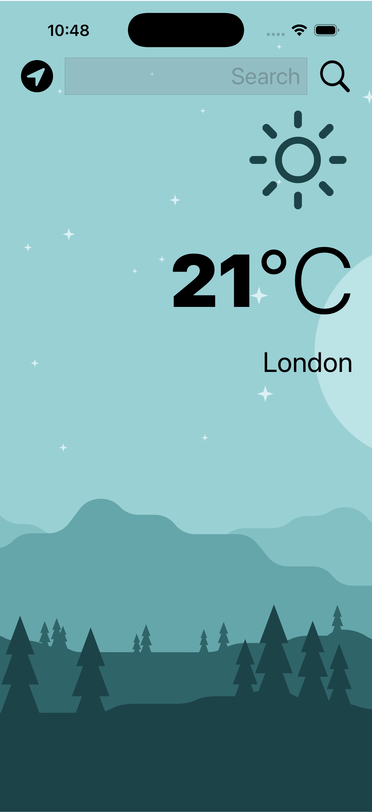
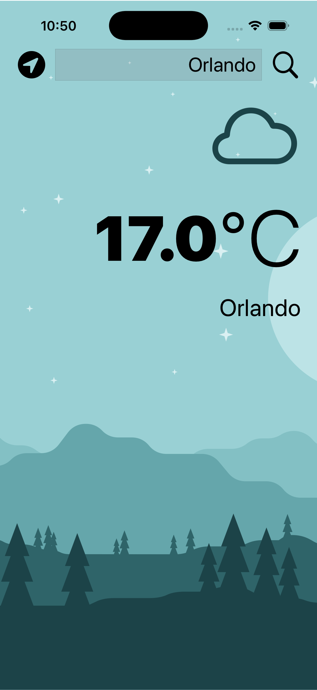
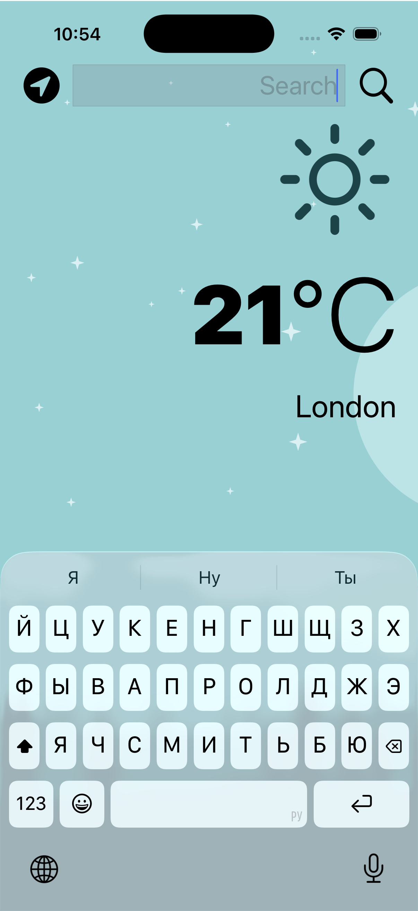

# 🌦 Clima iOS Weather App

A modern iOS weather application built with **Swift**, **UIKit**, **MVVM architecture**, and **Dependency Injection**.

The app provides real-time weather information using the OpenWeather API, supports current location weather lookup, and demonstrates MVVM architecture, dependency injection, unit testing, and service abstraction through protocols.

---

## 📱 Demo



---

## 🖼 Screenshots

### 🌍 Different Cities

| Kazan | London | Orlando |
|------|--------|---------|
|  |  |  |

### 📲 App Interface

| Main Screen |
|------------|
|  |

---

## 🚀 Features

- 🌍 Search weather by city name
- 📍 Get weather for the current device location
- 🌡 Display temperature and weather conditions
- ⚡ Real-time API integration
- 🧠 MVVM architecture
- 🔌 Dependency Injection using protocols
- 🧪 Unit and UI testing
- 🎨 Clean UIKit interface
- 📱 Responsive Auto Layout

---

## 🛠 Tech Stack

- Swift
- UIKit
- CoreLocation
- URLSession
- Codable
- MVVM
- Dependency Injection
- XCTest
- UI Testing
- Auto Layout
- Git & GitHub

---

## 🧪 Testing

The project includes **9 Unit Tests** and **2 UI Tests**.

### Unit Tests

#### WeatherModel Tests

- City name mapping
- Temperature mapping
- Temperature formatting
- Clear weather condition
- Rain condition
- Snow condition
- Fog condition
- Unknown weather condition

#### WeatherViewModel Tests

- Empty city validation and error handling

### UI Tests

- Application launch test
- Launch performance verification

The project uses **MockWeatherService** and dependency injection to improve testability and maintainability.

---

## 🧩 Architecture

The project follows the **MVVM (Model-View-ViewModel)** pattern.

### ViewController

Responsible for UI rendering and user interactions.

### ViewModel

Contains presentation logic, validation, and communication with services.

### Model

Represents API response structures and presentation models.

### Service Layer

Responsible for networking and API communication.

### Dependency Injection

Services are injected through protocols:

- `WeatherServicing`
- `WeatherService`
- `MockWeatherService`

This allows ViewModels to be tested independently from networking code.

---

## 🌐 API Integration

The application fetches real-time weather data from the OpenWeather API using:

- URLSession
- Codable
- JSONDecoder

---

## 📂 Project Structure

```text
Clima
├── Controllers
├── ViewModels
├── Models
├── Services
├── Resources
├── ClimaTests
├── ClimaUITests
└── Screenshot


📚 What I Learned
MVVM architecture in UIKit applications
Dependency Injection through protocols
Building testable code using mocks
REST API integration with URLSession
JSON parsing with Codable
Location services using CoreLocation
Writing Unit Tests and UI Tests
Auto Layout and responsive interfaces
Git and GitHub workflow
🎯 Why I Built This Project

This project was created to strengthen my iOS development skills and gain practical experience with:

Real-world networking
MVVM architecture
Dependency Injection
Testing strategies
UIKit application development
Working with REST APIs
📌 Future Improvements
🔔 Push notifications
⭐ Favorite cities
🌍 Multiple saved locations
📅 5-day weather forecast
⚡ Async/Await networking
🎨 Migration to SwiftUI
👨‍💻 Author

Aiaz Muzafarov

GitHub: swiftio116
LinkedIn: Aiaz Muzafarov
